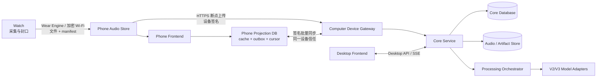
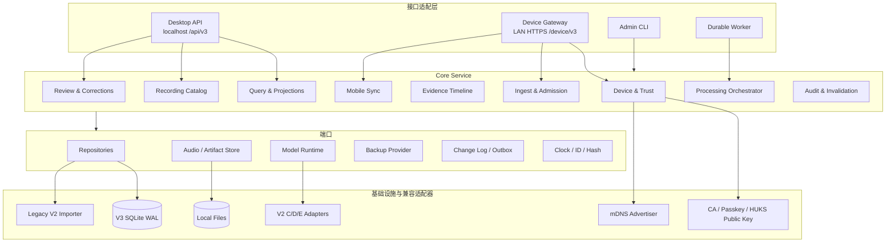
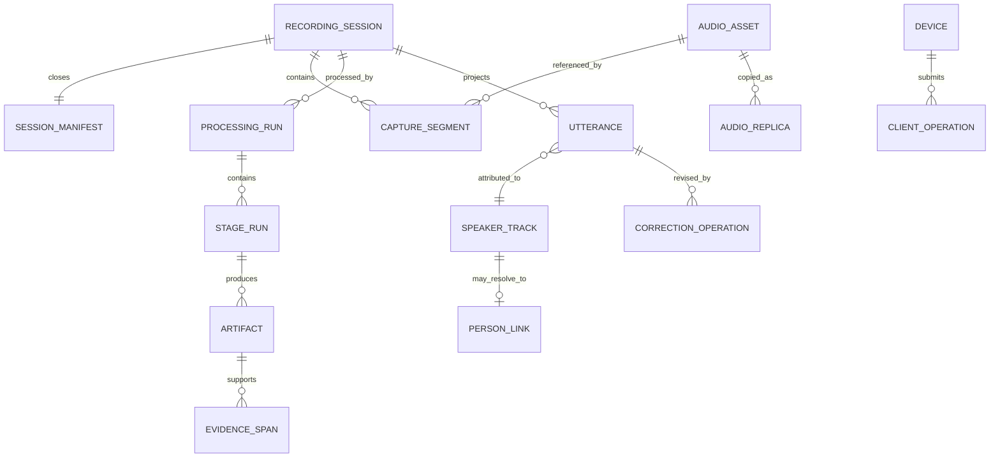
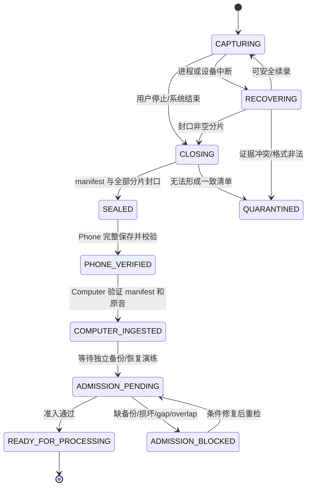
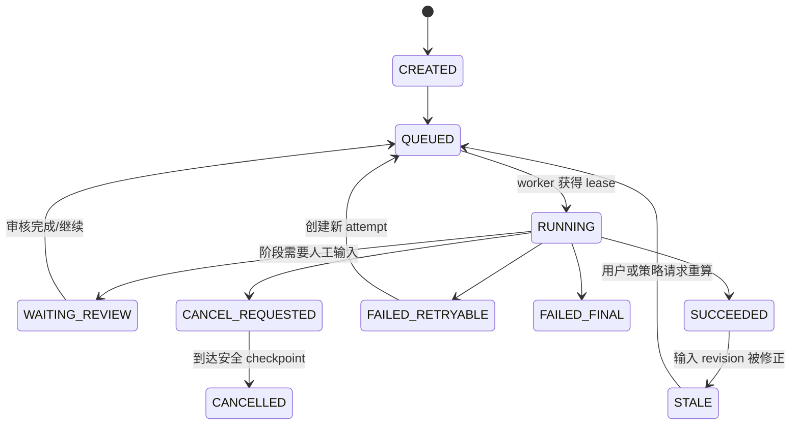

# V3 重构规格

> 文档状态：V3.0 实施基线（V3.0-A、V3.0-B 于 2026-08-31 完成；V3.0-C 工程实现完成、真机验收待执行；V3.0-D、V3.0-E 工程实现完成；V3.0-F 工程实现完成、真机验收待执行；V3.0-G 工程切换与真实 V2 本地迁移完成、生产配置和三端真机发布验收待执行）
> 适用范围：AllDayRecording Watch/Phone 应用、AllDayRecording-ASR 电脑端服务与电脑前端  
> V2 封存基线：电脑端 `c9d6f4b`，Watch/Phone 端 `f84c083`  
> 与后续版本的关系：V3.0 只完成重构与产品骨架；[V3 升级功能](V3升级功能.md) 中的可靠统一对话时间线从 V3.1 开始实现。

## 0. 结论与版本边界

V3 不是在 V2 页面和服务上继续叠加功能，而是建立一套新的产品骨架：

- 手表是可靠采集端；
- 手机是移动前端、离线数据副本和传输中继；
- 电脑是唯一权威数据端、处理端和完整管理端；
- Core Service 只处理领域数据、流程、权限和查询，不生成业务页面；
- 电脑前端和手机前端是两套独立 UI，通过稳定契约使用 Core Service；
- V2 的录音、传输、模型和证据能力通过适配器接入，不直接成为 V3 的领域边界；
- V3.0 先把数据对象、状态机、API、同步协议、持久任务和双端页面骨架固定下来，为 V3.1–V3.6 逐层增加能力。

V3.0 必须交付一个可用的纵向闭环：

```text
Watch 录音
→ Phone 安全保存
→ Phone 自动发现并上传 Computer
→ Core Service 验证、备份准入并运行现有 V2 处理适配器
→ Computer 前端显示会话、时间线、证据和处理状态
→ Phone 静默同步会话、处理状态和可缓存的时间线数据
→ 两端都能播放对应音频并看到同一状态版本
```

V3.0 不以新增更强 ASR、自动提醒、跨天认人或关系总结为目标。这些属于 V3.1–V3.6。V3.0 的成功标准是：以后增加这些功能时，不再改写采集、传输、页面承载和基础数据架构。

---

## 1. V3 产品目标

### 1.1 产品目标

1. **形成可信的个人对话底账**  
   从不可变原音开始，所有转写、说话人、事件和记忆都可追溯、可修正、可失效、可重算。

2. **完成真正的前后端分离**  
   Core Service 输出版本化资源和命令接口；前端决定页面结构、交互、文案和展示状态。后端不拼 HTML，不返回面向某个页面的 DOM 结构，也不通过修改后端页面文件“推倒重做前端”。

3. **提供电脑和手机两套适合各自场景的界面**  
   电脑端负责完整查看、批量管理、处理监控和复杂校正；手机端负责随时查看、回听、轻量操作、同步和通知，不机械缩小电脑页面。

4. **保持本地优先和三端可恢复**  
   原音不依赖云端。网络断开、应用重启或电脑关机不能破坏已封口录音；手机在电脑不可用时仍能查看已缓存数据和播放本地录音。

5. **只认证一次用户，持续静默认证设备**  
   首次配对通过 Passkey 完成用户授权并登记 HUKS 设备公钥；后续音频上传和数据同步都复用同一 CA、`receiver_id`、`device_id` 和设备密钥，不再反复弹出用户认证。

6. **让长流程成为可观察、可恢复的产品能力**  
   导入、备份、ASR、说话人、语义和以后新增的事件/记忆处理都使用持久任务；服务重启后能继续或明确失败，不依赖网页进程内线程状态。

7. **为 V3.1–V3.6 留下稳定扩展点**  
   V3.1 的 utterance、V3.2 的三层数据、V3.3 的提醒、V3.4 的人物聚类、V3.5 的人物记忆和 V3.6 的总结，都应作为新模块和新投影接入，不反向污染录音与传输领域。

### 1.2 用户可感知结果

- 用户在手表开始录音后，不需要理解分片、清单或处理 run；
- 手机能明确回答“录音是否安全保存、是否已上传电脑、电脑是否已处理”；
- 电脑能明确回答“数据从哪里来、现在处于哪一步、失败后如何处理”；
- 同一会话在手机和电脑显示同一个稳定名称、时间范围和处理版本；
- 所有可编辑结果都能回到原话和原音；
- 电脑不在线时，手机仍能展示上次同步的数据，修改操作进入本地待同步队列；
- 用户不需要因为换 Wi-Fi、同步元数据或查看新结果而重新做 Passkey 认证。

### 1.3 V3.0 非目标

- 不实现云端账号、多用户协作和公网访问；
- 不把手机变成完整 ASR/说话人处理节点；
- 不让手表承担查询、转写、人物或记忆逻辑；
- 不在 V3.0 自动创建提醒、长期人物记忆或关系判断；
- 不承诺兼容所有 V2 内部 Python/ArkTS 类和数据库表；
- 不原地破坏性改写 V2 数据库；
- 不为追求“统一代码”把电脑和手机 UI 合并为一套响应式页面。

### 1.4 不可违反的设计原则

1. 原始音频和已关闭 manifest 不可变；修正产生新版本或操作记录。
2. 电脑 Core Database 是业务事实的唯一权威源；手机只保存受控副本和待同步操作。
3. 页面不能直接访问 SQLite、模型、文件绝对路径或传输内部对象。
4. 模型只能产出候选或不可变 artifact，不能任意改写领域表。
5. 长任务先持久化再执行；内存状态只允许作为缓存。
6. 所有跨端写操作必须幂等，并带稳定 `operation_id` 或 `idempotency_key`。
7. 所有时间落库为 UTC，并保留采集时区；API 使用 ISO 8601，不返回已格式化页面文案。
8. 手机数据同步与音频字节传输共享信任根，但使用不同能力范围和接口路径。
9. 删除源录音必须是独立、可审计的保留策略，不能由“上传成功”或“处理完成”隐式触发。
10. V3 新代码不得依赖 `semantic_v2e02`、`quality_diarization_v2d3` 等版本名作为领域概念；版本差异留在模型/Legacy Adapter 内。

---

## 2. 手表、手机、电脑职责

| 端 | 权威职责 | 本地持久化 | 明确不负责 |
| --- | --- | --- | --- |
| Watch | 连续采集、WAV 分片、安全封口、中断恢复、录音会话 manifest、向 Phone 复制 | 当前录音、已封口分片、同步队列、会话摘要、必要诊断 | ASR、人物、事件、页面数据查询、电脑业务 API |
| Phone | 接收并验证 Watch 录音、移动端 UI、本地音频播放、离线结构化缓存、向 Computer 上传、轻量操作 outbox | 手机原音副本、接收索引、移动投影数据库、同步 cursor/outbox、配对 CA/设备标识；私钥在 HUKS | 业务事实最终裁决、模型处理、直接修改电脑数据库、自动删除原音 |
| Computer | Core Service、权威数据库、原音目录、独立备份准入、处理编排、模型运行、完整查询与校正、移动同步源 | 权威业务库、不可变 artifact、音频副本、任务状态、审计与备份证据 | 生成前端业务页面、依赖手机在线保存业务事实 |

### 2.1 三端数据路径



### 2.2 权威关系

- **原音内容权威**：由 SHA-256 标识的 `AudioAsset` 不因设备副本变化而改变；各端只持有 `AudioReplica`。
- **采集事实权威**：Watch 生成的已关闭 manifest 是采集顺序和绝对时间的原始声明，Computer 完整验证后接纳。
- **业务事实权威**：Computer Core Database。
- **手机显示权威**：Phone 本地投影；在线同步后必须携带 Core 返回的 `server_revision`。
- **用户离线修改权威**：Phone 先保存不可变 `CorrectionOperation` 到 outbox；Computer 接受后才成为新的权威 revision。

### 2.3 端间故障边界

- Watch→Phone 失败：Watch 保留已封口源文件并重试，不影响继续录音。
- Phone→Computer 失败：Phone 保留原文件、上传 offset 和 outbox，不回退为未接收。
- Computer 处理失败：不改变上传/备份事实；只把对应 `StageRun` 标为失败。
- 数据同步失败：Phone 继续使用上一次原子提交的投影，不显示半批数据。
- 手机缓存损坏：可从本地音频索引和 Computer 重新构建，不反向覆盖 Computer。

---

## 3. V2 总结、保留与废弃

### 3.1 V2 已形成的可用能力

V2 已经打通并验证了以下链路：

```text
Watch 连续 PCM 录音与 60 秒 WAV 封口
→ Watch/Phone 双 HAP 同步与恢复
→ Phone 本地索引、分组和播放
→ Passkey + HUKS + CA + mDNS 的 Phone→Computer 断点上传
→ 不可变 session manifest、source instance、SHA-256 和独立备份准入
→ V2-C ASR / 强制对齐 / 双假设 / VAD 门控
→ V2-D 重叠感知说话人时间线与人工身份审核
→ V2-E episode / utterance / scene / claim / action 证据
→ 本机网页评测、回听、校正和运行记录
```

V2 的主要价值不是页面，而是已经验证过的一组数据不变量、安全边界、模型证据和真实设备行为。

### 3.2 V2 必须保留

| 保留内容 | V3 处理方式 |
| --- | --- |
| Watch 单 AudioCapturer、内存队列上限和连续录音 | 保留行为和真机门禁，收敛到 Capture/Seal 模块 |
| `.part → WAV 头 → fsync → close → rename` | 作为不可变采集协议，不重写语义 |
| 中断恢复和非法文件隔离 | 保留，并统一映射到 `AudioReplica`/`QuarantineRecord` |
| Wear Engine 普通同步不删源文件 | 保留为默认保留策略 |
| 加密 Wi-Fi 批量 ACK 后再复核删除 | 保留为显式 Watch 清理策略，不扩展到 Phone 自动删除 |
| Phone 原子接收、索引重建和本地播放 | 保留实现能力，迁移到 Phone Audio Repository |
| Phone→Computer 的 CA 固定、Passkey 首次授权、HUKS 设备签名、mDNS、断点上传 | 直接作为 V3 Device Gateway 安全底座，并扩展能力范围 |
| session manifest、内容对象/文件实例分离、SHA-256 | 提升为 V3 `RecordingSession`、`AudioAsset`、`AudioReplica` 核心对象 |
| 备份、恢复演练和 production readiness | 保留为 Ingest/Admission 模块，不由 UI 绕过 |
| V2-C/D/E 模型与算法结果 | 通过 Legacy V2 Model Adapter 运行或导入，结果包装成 V3 Artifact |
| benchmark、truth、人工 review 证据 | 保留为 Lab/Evaluation 子系统，不进入普通用户主导航 |
| SQLite 本地优先部署 | V3.0 继续使用 SQLite WAL，但建立新的 V3 schema 和仓储边界 |
| CLI 诊断和批处理能力 | 保留为 Admin Adapter；不成为前端唯一业务入口 |

### 3.3 V2 明确废弃或降级为兼容层

| 废弃内容 | 原因与替代 |
| --- | --- |
| 后端路由同时负责静态页面、页面 DTO 和业务动作 | 改为独立 Desktop API；静态托管只能托管编译产物，不参与业务渲染 |
| 未版本化 `/api/*` 页面接口 | 新接口使用 `/api/v3/*`；手机使用 `/device/v3/*` |
| 前端全局可变 `state`、手工 DOM controller 和 1500 行 timeline renderer | 改为组件、路由、typed client、query cache 和按 feature 切分的 store |
| `WebApplication` 多重继承全部 use case | 改为显式依赖注入的 Core Service/Use Case Handler |
| `JobRegistry` 的 daemon thread 和内存任务状态 | 改为持久化 `Job`、`ProcessingRun`、`StageRun` 和 worker lease |
| 页面接口直接拼接数据库行、音频 URL 和显示字符串 | 改为稳定资源 DTO；格式化属于前端 |
| 继续扩展 1800 行 `storage/database.py` 和巨型 repository | V3 新仓储按 aggregate/port 划分；旧数据库只读导入 |
| V1 `daily-run` 作为产品主路径 | 移入 Legacy CLI；V3 产品只使用 session-native workflow |
| 版本号写入服务类名并被上层直接引用 | 模型实现注册为 adapter/version metadata，上层只依赖能力 port |
| benchmark、实验和普通产品页面混在同一导航 | Lab 独立入口，默认关闭或隐藏 |
| Phone/Watch 超大 ViewModel 和 1000+ 行 Transfer facade 持续增长 | 拆为 application use case、repository、transport client 和 UI state reducer |
| Preferences 保存结构化业务数据 | Preferences 只放小型配置；业务投影使用 RDB Store，音频使用文件系统 |

### 3.4 V2 数据迁移原则

1. V2 基线永久保留，V3 不对原 V2 SQLite 做破坏性迁移。
2. V3 使用新的数据库文件和 schema；首次启动只读打开 V2 数据库。
3. `LegacyV2Importer` 以 V2 数据库指纹和 import batch ID 保证幂等。
4. 原音按 SHA-256 登记，可引用原有只读文件，不强制重复复制。
5. V2 已完成 run 作为不可变 `Artifact` 导入，保留模型版本、配置、来源范围和原始 V2 ID。
6. V2 人工修正作为 `CorrectionOperation` 或 truth artifact 导入，不压平为“最终文本”。
7. 导入报告必须列出已导入、跳过、冲突、缺文件和不可解释的数据。
8. V3.0-G 通过前的迁移窗口内，V2 CLI 和 V2 数据库保持可独立回退；当前版本已退役 V2 CLI，只继续只读保留迁移证据。

---

## 4. Core Service 模块图

### 4.1 总体结构



### 4.2 Core 模块职责

#### Device & Trust

- 配对会话、设备登记、能力授权、撤销和审计；
- 复用现有 CA、`receiver_id`、Passkey 和 HUKS 设备公钥；
- 为音频上传与数据同步签发不同 scope；
- 不处理页面会话，不保存手机私钥。

#### Recording Catalog

- 管理 `RecordingSession`、`SessionManifest`、`AudioAsset` 和 `AudioReplica`；
- 验证时间范围、顺序、格式、大小和 SHA-256；
- 提供稳定媒体 ID，不把绝对文件路径暴露给前端。

#### Ingest & Admission

- 接收上传完成事件；
- 原子导入完整 manifest；
- 执行独立备份、恢复演练和 processing readiness；
- 只在会话完整且满足准入策略时触发处理。

#### Processing Orchestrator

- 持久化 job/run/stage/attempt；
- 维护依赖 DAG、worker lease、心跳、取消、重试和 checkpoint；
- 通过 Model Port 调用 V2 或未来 V3 实现；
- 不解释模型输出，不直接操作页面。

#### Evidence Timeline

- 统一保存音频区间、token、utterance、speaker track、person link 和来源引用；
- 区分原始模型 artifact、当前投影和用户修正；
- 为 V3.1 提供稳定的“谁在何时说了什么”查询边界。

#### Review & Corrections

- 管理 review item、用户修改、撤销、冲突和确认；
- 修正是操作记录，不直接覆盖原始识别 artifact；
- 接受修正后发布 invalidation event。

#### Query & Projections

- 为电脑和手机分别构建查询投影；
- 提供分页、过滤、资源 revision、媒体范围和聚合状态；
- 不返回 HTML、CSS class、按钮文案或手机/电脑专属布局。

#### Mobile Sync

- 维护每台设备的 cursor、change log、tombstone 和 outbox acknowledgement；
- 一次签名批量请求同时 push 手机操作并 pull 服务端变化；
- 输出版本化 mobile projection，不复制内部数据库表。

#### Audit & Invalidation

- 记录谁、何时、通过什么设备执行了什么操作；
- 维护 artifact 依赖图；
- 底层修正后把受影响派生结果标为 `stale` 并生成选择性重算请求。

### 4.3 建议代码边界

电脑仓库建议先让 V2 与 V3 并存：

```text
contracts/v3/                       # JSON Schema / OpenAPI / enum
src/allday_asr/v3/
  domain/                           # 实体、值对象、状态机；无框架依赖
  application/                      # use case、command、query、policy
  ports/                            # repository、media、model、backup、event
  adapters/
    sqlite/
    files/
    models_v2/
    legacy_v2/
    device_security/
  interfaces/
    desktop_api/
    device_api/
    cli/
    worker/
  bootstrap/                        # 组合根和进程入口
frontends/desktop/                  # 独立电脑前端源码
```

Harmony 仓库建议按设备继续物理分包，并在 Phone 内形成清晰层次：

```text
entry/.../capture|seal|sync         # Watch，只保留采集与复制
phone/.../domain                    # 移动端值对象和状态
phone/.../application               # sync/playback/command use cases
phone/.../data/local                # RDB Store、audio repository、outbox
phone/.../data/remote               # Device API client、upload client
phone/.../presentation/v3           # 页面和 UI state
common/.../contracts                # Watch↔Phone 纯协议和共享值对象
```

依赖方向固定为：`interface → application → domain`，adapter 实现 port。Domain 不允许导入 HTTP、SQLite、ArkUI、Vue、模型库或文件 API。

---

## 5. 主要数据对象

### 5.1 通用约定

- 跨设备主键使用 UUIDv7 或 ULID；旧自增 ID 只保存在 `legacy_ref`。
- 内容对象同时保存 `sha256`、`size_bytes` 和媒体格式。
- 每个可变 aggregate 有递增 `revision`；客户端写操作携带 `base_revision`。
- 每个派生对象有 `producer`、`producer_version`、`config_digest`、`input_refs` 和 `created_at`。
- 所有删除同步为 tombstone；物理清理由独立 retention job 完成。
- API enum 是封闭集合；未知新值在旧前端中按“未知状态”降级，而不是崩溃。

### 5.2 设备与同步对象

| 对象 | 核心字段 | 说明 |
| --- | --- | --- |
| `Device` | `device_id`, `kind`, `name`, `status`, `last_seen_at` | Watch/Phone/Computer 的稳定身份 |
| `DeviceCredential` | `device_id`, `public_key`, `algorithm`, `scopes`, `revoked_at` | Computer 保存的设备公钥和能力，不含私钥 |
| `PairingRecord` | `receiver_id`, `passkey_credential_ref`, `paired_at` | 首次用户授权审计 |
| `SyncCursor` | `device_id`, `projection_version`, `cursor` | Phone 已原子应用到的服务端位置 |
| `ChangeEvent` | `sequence`, `resource_type`, `resource_id`, `revision`, `operation` | Mobile projection 增量来源 |
| `ClientOperation` | `operation_id`, `device_id`, `kind`, `base_revision`, `payload`, `status` | Phone 离线操作和幂等回执 |

### 5.3 录音与文件对象

| 对象 | 核心字段 | 可变性与权威 |
| --- | --- | --- |
| `RecordingSession` | `session_id`, `captured_start`, `captured_end`, `timezone`, `state`, `revision` | 会话 aggregate；状态可变，采集范围关闭后不可改 |
| `SessionManifest` | `manifest_id`, `session_id`, `schema_version`, `sha256`, `entries` | 关闭后不可变 |
| `AudioAsset` | `asset_id`, `sha256`, `size_bytes`, `duration_ms`, `format` | 按内容标识，不可变 |
| `AudioReplica` | `replica_id`, `asset_id`, `device_id`, `storage_key`, `state`, `verified_at` | 某设备上的物理副本；路径不进入公共 API |
| `CaptureSegment` | `segment_id`, `session_id`, `asset_id`, `sequence`, `start_sample`, `captured_at` | manifest 中一个真实采集实例，不因相同内容而合并 |
| `BackupEvidence` | `session_id`, `provider`, `storage_kind`, `digest`, `restored_at` | 处理准入证据 |
| `QuarantineRecord` | `replica_id`, `reason`, `observed_metadata` | 非法、冲突或不可恢复文件的保留记录 |

`AudioAsset` 和 `CaptureSegment` 必须分开：完全相同的静音音频可以是同一内容，但在一天中出现的两次真实采集仍是两个 segment。

### 5.4 处理与证据对象

| 对象 | 核心字段 | 说明 |
| --- | --- | --- |
| `Job` | `job_id`, `kind`, `status`, `priority`, `lease_owner`, `heartbeat_at` | 通用持久任务 |
| `ProcessingRun` | `run_id`, `session_id`, `pipeline_version`, `input_revision`, `status` | 一次完整处理尝试 |
| `StageRun` | `stage_run_id`, `run_id`, `stage`, `attempt`, `status`, `checkpoint` | 具体阶段和重试 |
| `Artifact` | `artifact_id`, `kind`, `producer`, `version`, `input_refs`, `storage_ref`, `status` | 不可变模型/程序输出 |
| `EvidenceSpan` | `evidence_id`, `session_id`, `asset_id`, `start_ms`, `end_ms`, `artifact_id` | 所有高层结果回到音频的共同坐标 |
| `Utterance` | `utterance_id`, `session_id`, `start_at`, `end_at`, `speaker_track_id`, `text`, `revision` | V3.1 的统一话语对象；V3.0 先建立契约与 V2 投影 |
| `SpeakerTrack` | `speaker_track_id`, `session_id`, `label`, `artifact_id` | 录音内匿名说话人轨道，不等同人物 |
| `PersonLink` | `speaker_track_id`, `person_id`, `confidence`, `source`, `revision` | 人物关联，可空、可修正 |
| `CorrectionOperation` | `correction_id`, `target_type`, `target_id`, `before_revision`, `patch`, `actor` | 修改、撤销和审计的事实 |
| `ReviewItem` | `review_id`, `kind`, `target_ref`, `priority`, `status` | 电脑/手机共享审核队列 |

### 5.5 V3.2 以后预留对象

V3.0 不提前实现完整事件和记忆表，但契约必须允许以下对象通过独立模块加入：

- `EventOperation` / `EventCurrentState`；
- `EvidenceLink`；
- `Person` / `VoicePrototype` / `UnknownSpeakerCluster`；
- `MemoryFact` / `DailySummary` / `RelationshipObservation`；
- `GenerationRecord` / `InvalidationEdge`。

预留方式是稳定 ID、artifact provenance、evidence span、correction 和 invalidation 机制，不是现在建立一批没有真实语义的空表。

### 5.6 核心关系



---

## 6. 录音和处理状态机

### 6.1 录音会话状态机



说明：

- `RecordingSession.state` 表示 aggregate 到达的产品阶段，不代替各文件副本状态；
- `PHONE_VERIFIED` 不代表 Watch 可以立即删除，Watch 清理由独立策略和批次审计决定；
- `COMPUTER_INGESTED` 不代表可运行模型，必须经过 admission；
- `QUARANTINED` 保存证据，禁止自动丢弃；
- 会话进入 `SEALED` 后不允许追加 segment。需要补录时创建新会话，并通过业务关系关联。

### 6.2 AudioReplica 状态机

```text
DISCOVERED
→ RECEIVING
→ STORED
→ VERIFIED
→ AVAILABLE

任何阶段可进入 FAILED_RETRYABLE 或 QUARANTINED。
AVAILABLE 之后只能由显式 retention policy 进入 DELETE_PENDING → DELETED。
```

Replica 状态独立存在于 Watch、Phone 和 Computer；不能用一个布尔字段 `uploaded` 表示三端事实。

### 6.3 ProcessingRun 状态机



`StageRun` 使用同样的 `pending/running/waiting_review/succeeded/failed/cancelled/stale` 词表。一次重试新增 attempt，不把历史失败改写成成功。

### 6.4 阶段 DAG

V3.0 使用现有能力时的默认处理依赖为：

```text
ingest_verified
→ backup_admitted
→ window_plan
→ speech_gate
→ asr_and_alignment
→ diarization
→ utterance_projection
→ semantic_evidence_optional
→ mobile_projection
```

- `semantic_evidence_optional` 失败不能使原音、转写和说话人不可用；
- Review 支线可以让 run 进入 `waiting_review` 或让某类结果显示 `needs_review`，但不能伪装成整体失败；
- 某个 utterance 文本修正后，只让依赖它的事件/记忆 artifact 失效，不重跑音频导入。

### 6.5 聚合状态生成规则

电脑和手机显示的“处理状态”必须由服务端根据 stage 状态计算，前端不能各自猜测。建议稳定输出：

```text
awaiting_upload
verifying
backup_required
ready
processing
needs_review
available
failed
stale
```

响应同时返回 `status_code`、`current_stage`、`progress`、`updated_at` 和可选 `blocking_reason`；中文显示文案由各前端维护。

---

## 7. 前后端契约、认证复用与手机数据存储

### 7.1 两个 API 边界

| API | 网络边界 | 认证 | 用途 |
| --- | --- | --- | --- |
| Desktop API `/api/v3/*` | 默认仅 `127.0.0.1` | 启动会话 token/本机安全上下文 | 电脑完整查询、命令、媒体范围、SSE |
| Device API `/device/v3/*` | 配对后的局域网 HTTPS | 固定 CA + HUKS 设备签名 + scope | Phone 文件上传、批量数据同步、移动命令 |

两者调用同一个 application core，但使用不同 listener、认证器、DTO 和授权策略。Device API 永远不能因为“也是前端”而访问 benchmark、数据库管理、任意文件或管理员命令。

### 7.2 契约规则

- OpenAPI/JSON Schema 是 Python、Vue 和 ArkTS 的共同事实源；
- API 从 `/v3` 开始显式版本化；
- 列表必须分页，使用 opaque cursor，不暴露数据库 offset；
- 错误结构固定为 `code/message/details/request_id`，前端不解析后端异常字符串；
- 写命令返回接受后的 resource revision 或 durable job ID；
- 长任务状态通过 Desktop SSE 推送，断线后可用 REST 重新读取；
- Phone 不保持长连接，使用前台触发和系统允许的后台增量同步；
- 媒体通过 `media_id + range` 访问，不在 JSON 中返回电脑绝对路径；
- 契约测试必须同时验证 Python producer、Desktop client 和 ArkTS client fixture。

### 7.3 复用音频传输认证

首次配对流程保持：

```text
扫描 Computer 二维码
→ 校验 CA DER SHA-256 指纹
→ Passkey 完成一次用户授权
→ Phone 在 HUKS 生成不可导出的设备私钥
→ Computer 保存设备公钥、device_id 和允许 scopes
```

V3 scopes 至少分为：

```text
audio.upload
data.sync.read
data.sync.write
device.status
```

后续同步不再次调用 Passkey。每次请求仍需安全的设备签名，但这是 HUKS 静默操作，不是用户认证弹窗。

为减少认证往返，结构化数据使用一个批量同步请求：

```http
POST /device/v3/sync

{
  "projection_version": 1,
  "cursor": "opaque-cursor",
  "client_operations": [...],
  "pull_limit": 500
}
```

服务端在一个受签名保护的响应中返回操作回执、资源变化、tombstone 和 `next_cursor`。音频字节因为体积和断点需求继续使用独立 upload/chunk 请求，不与 JSON 批次混装。

### 7.4 Phone 本地数据布局

Phone 使用三种存储，不再把所有状态塞进 Preferences 或一个巨型 JSON：

| 存储 | 内容 |
| --- | --- |
| 文件系统 | Watch 原始 WAV、manifest、本地播放索引；V3.0 不自动删除 |
| RDB Store | session 投影、处理摘要、utterance 缓存、review 摘要、sync cursor、outbox、tombstone |
| Preferences/HUKS | `receiver_id`、`device_id`、CA 路径、少量 UI 配置；私钥只在 HUKS |

默认缓存策略：

- 所有本机录音的 session/transfer 状态长期保留；
- 最近 30 天的 utterance 和处理投影自动保留，可按需拉取更早数据；
- 未同步 outbox、冲突和用户标记永不因缓存清理丢失；
- 音频删除只由用户确认或未来明确的保留策略触发；
- 手机数据库可由 Computer 重新构建，但本地未同步操作必须先导出或恢复。

### 7.5 同步与冲突规则

1. Phone 先在一个本地事务中写 `ClientOperation`，再更新乐观 UI。
2. 同步请求先 push outbox、再 pull 服务端变化，服务端对 `operation_id` 幂等。
3. 服务端生成的数据以服务端 revision 为准。
4. 用户修正使用 `base_revision`；不匹配时返回 conflict，Phone 保留双方版本并要求处理。
5. 只有纯 UI 偏好允许本地 last-write-wins。
6. Phone 应用一批变化和推进 cursor 必须在同一个 RDB 事务中完成。
7. schema/projection version 不兼容时清空可重建投影并全量拉取，但不得清空 outbox 和本地音频。
8. 撤销配对后停止同步并清除凭据；是否删除缓存由用户单独决定。

---

## 8. 电脑端页面结构

电脑端面向“完整理解与管理”，使用独立 Desktop Frontend。建议一级导航如下。

### 8.1 页面与路由

| 路由 | 页面 | V3.0 主要内容 |
| --- | --- | --- |
| `/` | 总览 | 今日/最近会话、待处理问题、设备状态、存储与备份、正在运行的任务 |
| `/recordings` | 录音库 | 按日期、设备、处理状态筛选；批量选择和完整性状态 |
| `/recordings/:sessionId` | 会话详情 | 概览、时间线、原音、说话人、证据、处理历史 |
| `/reviews` | 审核收件箱 | 转写、说话人、可能语音、身份和未来事件候选的统一队列 |
| `/processing` | 处理中心 | job/run/stage、队列、资源占用、失败原因、重试与取消 |
| `/devices` | 设备与传输 | Watch/Phone/Computer、配对、最近同步、撤销、上传记录 |
| `/data` | 数据与备份 | 原音完整性、备份准入、恢复演练、容量、隔离项 |
| `/settings` | 设置 | 模型、处理策略、手机缓存策略、通知、隐私与保留策略 |
| `/lab` | 实验室 | benchmark、truth、模型对比和开发工具；默认不进入普通导航 |

### 8.2 会话详情结构

```text
会话标题 / 绝对时间 / 来源设备 / 聚合状态
├─ 概览：时长、分片、备份、处理版本、问题摘要
├─ 时间线：utterance、speaker、置信度、证据回听
├─ 原音：manifest、分片、副本、校验与媒体播放
├─ 说话人：track、人物关联、重叠和待审核
├─ 证据：artifact、输入版本、来源区间和修正历史
└─ 运行历史：processing run、stage、checkpoint、日志摘要
```

### 8.3 电脑前端交互原则

- 路由决定页面，刷新后可恢复当前 session/tab/filter；
- 使用 feature store，不建立一个覆盖全应用的巨型可变 state；
- server state 由 query cache 管理，编辑草稿与服务端投影分离；
- 所有播放由统一 Media Controller 仲裁，跨页面最多一个音源播放；
- 长列表虚拟化或分页，不一次渲染全天所有 token；
- “重新处理”“删除”“撤销配对”等动作必须展示影响范围；
- 实验字段不得泄漏到普通产品页；
- Desktop Frontend 可以由 Core 进程托管编译后的静态 dist，但源码、路由和渲染完全独立，后端不能返回业务 HTML。

---

## 9. 手机端页面结构

手机端面向“状态确认、随时回听和轻量处理”，以本地数据优先显示，不等待电脑在线。

### 9.1 一级导航

| Tab/页面 | V3.0 主要内容 |
| --- | --- |
| 首页 | Watch/Phone/Computer 三段状态、最近录音、待上传数、处理中会话、同步时间 |
| 录音 | 手机本地录音分组、日期、时长、播放、上传与处理徽标 |
| 回顾 | 已同步的 utterance/时间线摘要、待审核摘要；V3.0 可先只读 |
| 设置 | 电脑配对、同步策略、缓存、存储、隐私、开发者入口 |

### 9.2 二级页面

| 页面 | 内容 |
| --- | --- |
| 录音详情 | 本地播放、分片范围、Watch→Phone/Phone→Computer 状态、Computer 处理摘要 |
| 时间线详情 | 本地缓存 utterance、说话人标签、点击回听；无缓存时提示联网拉取 |
| 同步中心 | 当前同步、失败重试、已上传/待上传、数据 cursor、最近错误 |
| 电脑连接 | 一次扫码配对、已配对电脑、CA 指纹、最近发现、撤销配对 |
| 缓存与存储 | 音频占用、结构化缓存范围、清理可重建数据、保护未同步操作 |
| 冲突处理 | 展示手机离线修改与电脑新 revision，允许保留一方或重新编辑 |

### 9.3 手机 UI 状态来源

- 页面只订阅 Phone Repository 的稳定 UI state；
- Remote client 不直接修改页面字段；
- 上传进度、结构化同步和 Watch 接收是三个独立状态域；
- 录音列表首先来自本地 Audio Repository，再与 Computer 投影合并；
- 电脑离线时仍显示最后同步 revision 和明确的“上次更新于”；
- 系统通知只使用已持久化状态，应用重启后不丢失“待上传/待审核”。

### 9.4 V3.1 页面预留

V3.0 的时间线详情必须按 `utterance_id`、`revision`、`speaker_track_id` 和 `evidence media range` 渲染。V3.1 增加文本/说话人修正时，只需开放编辑和 outbox command，不更换页面的数据模型。

---

## 10. V3.0 实施阶段与验收标准

### V3.0-A：基线冻结与契约先行

#### 目标

把 V2 变成可回退基线，冻结 V3 的术语、边界和跨语言契约，避免电脑端和手机端分别发明数据结构。

#### 工作范围

- 保存两个仓库 V2 基线 commit 和质量报告；
- 确认本规格和关键 ADR；
- 建立 `contracts/v3`，定义 ID、时间、状态 enum、错误、分页、sync envelope；
- 建立 Desktop API 与 Device API OpenAPI 骨架；
- 固定生产 Passkey RP ID/origin 的配置方式，禁止占位域名进入真机发布；
- 建立 Python/Vue/ArkTS contract fixture 测试；
- 建立 V3 feature flag 和并行目录，不改写 V2 默认入口。

#### 验收标准

1. 两个 V2 commit 可独立检出，电脑 171 个 Python 测试、9 个前端测试/构建、Harmony Linter 与 79 个 Host Test 有可复查记录。
2. `RecordingSession`、`AudioAsset`、`ProcessingRun`、`Utterance`、`DeviceSync` 的 schema 有唯一版本源。
3. Python、Desktop 和 ArkTS 对同一 fixture 解码结果一致，未知 enum 有降级测试。
4. API 评审能明确判断一个接口属于 Desktop 还是 Device，不存在“两个都能调”的管理员接口。
5. V3 代码可以空启动，且不改变 V2 数据库和默认 V2 行为。

### V3.0-B：Core Data 与 Legacy Import

#### 目标

建立不依赖页面和模型的 V3 Core、全新数据库、文件目录和只读 V2 导入链路。

#### 工作范围

- 实现 domain、application、port 和 composition root；
- 建立 V3 SQLite WAL schema、migration runner 和事务边界；
- 实现 Recording Catalog、Device、Artifact、Correction、Change Log 仓储；
- 实现 Audio/Artifact Store 和 media ID；
- 实现只读 `LegacyV2Importer` 与导入报告；
- 建立审计、revision、idempotency 和 tombstone 基础设施。

#### 验收标准

1. 从空库可重复迁移到最新 schema；中途失败不会留下半个版本。
2. 同一 V2 数据库导入两次不产生重复 session、asset、artifact 或 correction。
3. 随机抽取的 V2 session 在 V3 中保持文件实例数、顺序、时长和 SHA-256 一致。
4. 缺文件、冲突路径和无法映射对象出现在导入报告，不被静默忽略。
5. V2 数据库以只读方式打开；测试确认导入前后其文件摘要不变。
6. Core 单元测试不启动 HTTP、Vue、ArkUI 或模型。

### V3.0-C：Device Gateway 与 Phone 本地数据层

#### 目标

在现有安全音频传输上增加受限 Device API 和 Phone 投影库，实现“一次配对、音频与数据共同信任”。

#### 工作范围

- 把现有 transfer security 封装为 Device & Trust adapter；
- 增加 scope、撤销和设备审计；
- 保留现有断点上传，接入 Recording Catalog/Ingest；
- 实现 `/device/v3/sync` 批量 push/pull；
- Phone 建立 RDB Store、projection repository、outbox、cursor 和 schema upgrade；
- 实现全量重建、增量同步、冲突保留和离线重试；
- 把 Phone Preferences 中的业务状态迁移到对应 repository。

#### 验收标准

1. 真实 Phone 首次扫码只出现一次 Passkey 用户授权；之后上传音频和同步数据不再弹用户认证。
2. 换 Wi-Fi 后按稳定 `receiver_id` 重新发现，CA 不匹配的主机始终被拒绝。
3. 一个签名批量请求可提交 outbox 并取得增量变化；重放同一 `operation_id` 不重复执行。
4. Phone 在飞行模式重启后仍能显示本地录音、上次处理状态和未同步操作。
5. 同步在响应中途崩溃时，cursor 不前进；重启后重放得到一致结果。
6. 清空可重建投影后能从 Computer 恢复，未同步 outbox 和本地音频不丢失。
7. Device API 无法访问 Desktop 管理、Lab、任意文件路径或未授权 scope。

### V3.0-D：持久处理编排与 V2 Adapter

#### 目标

把 V2 工作流从网页进程内线程和版本化 service 调用中抽出，形成可恢复的 processing DAG。

#### 工作范围

- 实现 Job/ProcessingRun/StageRun/Attempt/Lease；
- 实现 worker 心跳、超时回收、checkpoint、重试、取消和恢复；
- 把 session backup/readiness 接入 Admission；
- 用 adapter 包装现有 V2-C/D/E 能力；
- 将输出登记为不可变 Artifact，并生成 V3 utterance/speaker 投影；
- 发布 change event，驱动电脑查询和 Phone mobile projection；
- 替换 V3 路径中的 in-memory `JobRegistry`。

#### 验收标准

1. 任务提交后立即持久化；杀死服务再启动，任务可继续、重试或明确标记为失去 lease。
2. 同一 session/input revision/pipeline version 的重复命令不会并行创建重复有效 run。
3. 一个固定小型 fixture 经 V2 Adapter 后，关键 token/turn/utterance 数和来源区间与 V2 基线一致。
4. 一个 stage 失败不会改变已验证原音、备份证据和已完成 artifact。
5. retry 创建新 attempt；历史失败、日志摘要和配置仍可查询。
6. 修改一个 utterance 后，依赖 artifact 可被标为 stale，录音导入和无关阶段不被重跑。

### V3.0-E：电脑前端重建

#### 目标

交付独立 Desktop Frontend，覆盖 V3.0 电脑页面结构，并停止以页面为中心扩展后端。

#### 工作范围

- 建立路由、布局、typed API client、query cache、feature store；
- 实现总览、录音库、会话详情、审核、处理、设备、数据、设置和 Lab 边界；
- 建立统一 Media Controller、错误边界、loading/empty/offline 状态；
- 使用 SSE 显示 durable job 更新，断线后 REST 恢复；
- 把 V2 页面需要保留的时间线、回听和评测能力迁入 feature；
- 禁止 V3 页面依赖旧 DOM ID 和 `workspace/controller.js` 全局状态。

#### 验收标准

1. Desktop Frontend 可以针对 mock contract 独立开发、测试和构建，不需导入 Python 源码。
2. Core Service 删除或替换任意页面组件时无需修改业务 use case；前端文案变化不修改后端。
3. 刷新任一会话详情子路由可恢复 session、tab 和过滤条件。
4. 跨页面最多一个音源播放，切换 session 会停止并释放旧音频。
5. 处理任务在页面重开和服务重启后仍显示真实持久状态。
6. 普通导航不暴露 benchmark/实验术语；Lab 入口有明确标识。
7. 电脑端 V3.0 关键路径有组件测试、API contract 测试和浏览器 E2E。

### V3.0-F：手机前端重建

#### 目标

让 Phone 页面完全基于本地 repository 和 Device API，交付适合移动场景的首页、录音、回顾和设置。

#### 工作范围

- 拆分现有巨型 ViewModel 为 use case、repository、remote client 和 UI reducer；
- 实现首页、录音列表/详情、时间线只读回顾、同步中心、电脑连接、缓存与冲突页；
- 合并本地音频事实和 Computer 投影，不阻塞首屏；
- 增加同步/处理徽标和最后更新时间；
- 将未同步操作、冲突和错误持久化；
- 保留本地播放与当前 Watch 同步能力。

#### 验收标准

1. Computer 关机时，Phone 冷启动仍能查看本地录音、播放音频并浏览已缓存时间线。
2. Computer 恢复后一次同步更新会话状态，不重复上传已验证文件。
3. 页面销毁和应用重启不会丢失上传 offset、sync cursor、outbox 或冲突。
4. Remote client、RDB Store 和页面组件之间没有互相直接持有；可用 fake repository 测试页面。
5. 会话详情同时显示 Watch→Phone、Phone→Computer 和 Computer processing 三段状态。
6. 时间线以 V3 `utterance_id/revision/evidence` 渲染，V3.1 开放编辑无需更换本地 schema 主键。
7. Watch 录音/恢复/同步真机回归不因 Phone UI 重构退化。

### V3.0-G：迁移、切换与发布验收

> 2026-08-31 状态：V3 默认入口、Legacy 只读边界、版本冻结、真实 V2 本地双备份/导入和自动化门禁已经完成；两个备份目前仍位于同一台电脑，真实 Passkey RP ID/origin、独立灾备介质及 Watch→Phone→Computer 新会话真机验收尚未完成。完整证据与剩余签字项见 [V3.0-G 迁移、切换与发布验收](V3.0-G-migration-cutover-release.md)。

#### 目标

完成真实数据迁移和跨端纵向验收，把 V3 设为默认入口，同时保留可执行回退。

#### 工作范围

- 对真实 V2 库和音频做双份只读备份；
- 执行 Legacy Import 并核对报告；
- 完成 Watch→Phone→Computer→处理→双端展示 E2E；
- 完成安全、故障注入、容量、升级和回退测试；
- 冻结 V3.0 数据/API/projection version；
- 迁移窗口内先把 V2 页面和命令移入明确的 Legacy 入口；切换完成后从当前运行时退役；
- 更新运维、备份、恢复、配对、隐私和故障处理文档。

#### 验收标准

1. 至少一段全新真实会话完整经过三端链路，所有分片 SHA-256、顺序、时长和绝对时间可核对。
2. Watch、Phone、Computer 在断网、重启、重复请求和处理中断后都能恢复，且没有静默丢失或覆盖。
3. Computer 与 Phone 对同一 session 显示相同 resource revision 和聚合状态。
4. V2 真实数据库导入后，抽样会话的原音、token/utterance、speaker 和人工修正可追溯。
5. 撤销 Phone 设备后，旧设备签名不能上传或同步；本地缓存是否删除由用户独立选择。
6. V3 默认入口不调用旧未版本化页面 API；历史 V2 数据保持只读可追溯，当前运行时不再提供 Legacy 入口。
7. 两仓库测试、Lint、生产构建、契约测试、E2E 和真机检查全部通过，无未解释的数据变化。

### 10.1 阶段依赖

```text
V3.0-A
  ↓
V3.0-B
  ├─→ V3.0-C ─→ V3.0-F
  └─→ V3.0-D ─→ V3.0-E
                    ↓
                 V3.0-G
```

E 与 F 可以在 B 的领域/契约稳定后并行，但都不能绕过 C/D 的真实持久状态自行模拟产品逻辑进入发布。

---

## 11. V3.0 整体验收标准

V3.0 只有同时满足以下条件才算完成：

### 架构

- Core domain/application 不依赖 Vue、ArkUI、HTTP、SQLite 和具体模型；
- 电脑与手机两套前端无共享页面代码假设，只共享契约；
- Desktop API 与 Device API 权限和网络边界可独立测试；
- V3 长任务不使用仅存在于进程内的状态作为事实源。

### 数据

- 原音、manifest、artifact 和 correction 的来源链完整；
- V2 只读导入可重复、可核对、可回退；
- 手机缓存可重建，outbox 不可被重建流程清除；
- 状态、revision、tombstone 和时间格式跨端一致。

### 安全

- 首次配对以外不重复要求 Passkey 用户确认；
- 每个 Device 请求仍使用一次性 challenge 和 HUKS 签名；
- mDNS 只发现地址，CA 和设备身份决定信任；
- 无忽略证书、长期 Bearer Token 或任意文件读取降级路径。

### 可恢复性

- 三段传输、数据同步和处理任务均可在重启后恢复；
- 重复请求幂等；
- 失败不会把已验证状态回退或删除证据；
- 删除操作有独立确认、审计和保留策略。

### 用户体验

- 手机离线可查看本地录音和缓存数据；
- 电脑能查看完整数据、处理和审核信息；
- 两端状态含义一致但页面结构适合各自设备；
- 用户不需要理解 V2-C/D/E run 才能判断录音是否安全和结果是否可用。

---

## 12. 为 V3.1–V3.6 准备的接口

| 后续版本 | V3.0 必须已经提供的地基 |
| --- | --- |
| V3.1 可靠统一对话时间线 | `Utterance`、`SpeakerTrack`、绝对时间、evidence media range、revision、CorrectionOperation、双端时间线投影 |
| V3.2 三层数据架构 | Artifact provenance、EvidenceSpan、依赖图、invalidation、重算和版本化 producer |
| V3.3 智能提醒闭环 | ClientOperation、ReviewItem、结构化 command、证据链接、Phone outbox 和通知入口 |
| V3.4 未知人物聚类 | 匿名 track 与 person link 分离、artifact 不可变、人工 merge/split correction |
| V3.5 跨天人物记忆 | 稳定 person ID、跨 session 查询、事实/推断分离和时间有效性扩展点 |
| V3.6 每日总结与关系观察 | 事件/记忆投影端口、generation record、时间窗口、可重算和事实/观察展示类型 |

V3.1 开始后，不允许为了实现某个智能功能绕过这些接口直接读旧 V2 表或把模型输出写入页面专用 JSON。

---

## 13. 测试与质量门禁

### 13.1 必须长期保留的门禁

- 电脑端 Python unit/integration、Ruff、Desktop unit/build；
- Harmony Code Linter、Watch/Phone Host Test、Debug/Release 构建；
- Watch 真机录音、熄屏、恢复、普通同步和加密同步；
- Phone 真机配对、换 Wi-Fi、上传、离线启动和本地播放；
- 原音/manifest/backup 的 SHA-256 与恢复演练。

### 13.2 V3 新增门禁

- OpenAPI/JSON Schema 跨 Python/Vue/ArkTS fixture；
- V3 migration 与 Legacy Import property/integration test；
- durable worker kill/restart 故障注入；
- Device API 授权矩阵、重放、过期 challenge、错误 CA 和撤销设备测试；
- Phone sync cursor/outbox 原子性和 schema upgrade 测试；
- Desktop 浏览器 E2E 与 Phone fake-repository UI 测试；
- 完整三端 session 的 trace ID/operation ID 关联检查。

### 13.3 完成定义

任何阶段的“已完成”必须同时具备：

```text
代码与迁移
+ 自动化测试
+ 可观察状态
+ 失败/恢复路径
+ 数据保护说明
+ 对应文档
+ 不依赖口头记忆的验收证据
```

只有页面截图、单次成功运行或 `BUILD SUCCESSFUL` 不能单独作为阶段完成证据。

---

## 14. 已冻结的关键决策

1. V3.0 新建 Core schema，不原地改造成 V2 schema。
2. Computer 是业务权威端，Phone 是可离线工作的受控副本。
3. Phone 音频和结构化数据复用一次配对信任，但接口和 scope 分离。
4. 后续静默认证使用 HUKS 设备密钥；Passkey 不作为每次同步步骤。
5. Computer 与 Phone 是两套前端，不开发一套页面自适应两端。
6. V2 算法通过 adapter 保留，不再把 V2 版本名传播到 Core。
7. 处理任务、同步 cursor 和用户 outbox 必须持久化。
8. V3.0 先完成架构与 V2 能力纵向闭环，V3.1 才开始升级“谁在何时说了什么”。

需要在 V3.0-A 配置落地、但不改变架构的部署项只有：真实 Passkey RP ID/origin、独立备份位置、手机缓存天数和模型资源档位。
